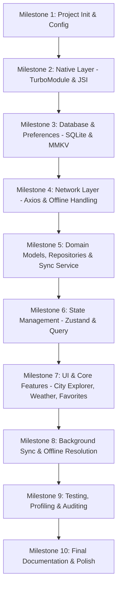

# Implementation Plan - Offline City Explorer

A production-ready React Native application called **Offline City Explorer** built on the React Native New Architecture with TypeScript, Clean Architecture (Feature-Based), SQLite, MMKV, Zustand, TanStack Query, and custom native TurboModules / JSI modules.

---

## User Review Required

> [!IMPORTANT]
> **React Native New Architecture Requirement:**
> We will initialize the project using React Native `0.76+` (or latest `0.86.0`), which has the New Architecture (New Arch / TurboModules / Fabric) enabled by default.
>
> **Proposed Milestones and Execution Plan:**
> Since this is a production-level enterprise application, we will work incrementally. We propose a 10-milestone plan. We will start with **Milestone 1** (Project Initialization & Configuration) upon your approval.

---

## Open Questions

> [!WARNING]
> **Package Choice for SQLite:**
> For local SQLite storage under the New Architecture, we propose using `@op-engineering/op-sqlite` or `react-native-quick-sqlite`. `@op-engineering/op-sqlite` uses modern C++ JSI bindings, making it extremely fast and compatible with the New Architecture. We will install this unless you prefer a different SQLite library.
>
> **Bundle Identifier / Package Name:**
> By default, we will use `com.offlinecityexplorer` for Android and iOS. Please let us know if you want a custom package name (e.g. `com.jigar.offlinecityexplorer`).

---

## Proposed Milestones



### Milestone 1: Project Initialization & Configuration (Current Focus)
We will create and configure the react-native application.
- Initialize the application named `OfflineCityExplorer` inside the workspace directory using the latest CLI template.
- Establish the **Feature-Based Clean Architecture** directory structure inside `src/`.
- Configure `tsconfig.json` for strict type checking and path mappings (`@/*` -> `src/*`).
- Set up formatting/linting using ESLint, Prettier, Husky, and lint-staged.
- Add base architecture dependencies (`zustand`, `@tanstack/react-query`, `axios`, `react-native-mmkv`, `@op-engineering/op-sqlite`, `react-native-vector-icons`, etc. - explaining the need for each).

### Milestone 2: Native Layer (TurboModules & JSI Sort Engine)
- Implement `DeviceStatusTurboModule` using TypeScript specs and Codegen.
- Write iOS Swift/Objective-C++ and Android Kotlin/C++ implementations for:
  - Battery Percentage
  - Network Status
  - GPS Coordinate Retrieval
  - Device Info (Name, Model, OS Version)
- Create JSI native sorting engine (`CitySortEngineJSI`) using C++ for rapid, main-thread-free sorting.
- Create execution time benchmark comparing JavaScript's built-in sort and the JSI native sorting engine over 100,000 cities.

### Milestone 3: Database & Local Storage Layer
- Implement SQLite configuration using `@op-engineering/op-sqlite`.
- Set up schema initialization and migrations for `Cities`, `Weather`, `Favorites`, and the `PendingSyncQueue` tables.
- Configure `react-native-mmkv` for fast key-value user preferences (theme settings, cache timestamps).
- Abstract raw SQL behind repositories; components should only interact with repositories.

### Milestone 4: Network Layer (Axios with Offline Capabilities)
- Create specialized Axios client containing:
  - Global response/request interceptors
  - Customizable timeouts, cancellations, and exponential retry strategy
  - Offline mode detection and automatic request queueing
  - Response transformation & request deduplication to prevent redundant network calls

### Milestone 5: Domain Models & Repositories
- Build strict TypeScript domain models for all features.
- Implement Repository classes (e.g. `CityRepository`, `WeatherRepository`, `FavoritesRepository`) as the single source of truth for both online and offline states.
- Create weather fetcher service that queries Open-Meteo API.

### Milestone 6: State Management (Zustand & TanStack Query)
- Configure TanStack Query for cache management, query key structures, and cache invalidation rules.
- Set up Zustand stores for local UI state (e.g. search filters, active tabs, themes) while ensuring no duplicate server state is placed in Zustand.

### Milestone 7: UI & Core Features (City Explorer, Weather, Favorites)
- Build responsive, fluid user interface using functional components and custom hooks.
- Features:
  - **City Explorer**: Paginated FlashList with infinite scroll, search bar with debounce, pull-to-refresh, empty and loading states.
  - **Weather Display**: Local cache, stale time configuration (15-30 minutes), and error layouts.
  - **Favorites Manager**: Marking cities as favorites with optimistic UI updates.
- Ensure 60 FPS scrolling targets utilizing `React.memo`, stable keys, and `FlashList` properties.

### Milestone 8: Offline Synchronization & Background Queue
- Implement background synchronization task utilizing `react-native-background-fetch`.
- Process the `PendingSyncQueue` when connectivity is restored.
- Define a deterministic conflict-resolution engine (e.g. last-write-wins with timestamps).

### Milestone 9: Testing, Profiling & Auditing
- Create unit tests for stores, hooks, and repositories using Jest and `@testing-library/react-native`.
- Run profiling runs with Hermes and Flipper/Instruments to analyze Memory usage, JS Thread performance, and startup times.

### Milestone 10: Final Documentation & Production Polish
- Finalize the README, complete folder documentation, and output the performance report.

---

## Detailed Milestone 7 Implementation Plan: UI Layer & Screens

We will implement the user interface, custom bottom tab structure, search autocomplete list, weather display, favorites dashboard, and settings panels.

### 1. Architecture
We will set up UI components and navigation configurations under `src/`:

```
src/
├── navigation/
│   └── AppNavigator.tsx     # Native stack router linking screens
├── screens/
│   ├── SearchScreen.tsx     # City search autocomplete input with FlashList
│   ├── WeatherDetails.tsx   # Detailed city forecast graphs and metrics
│   ├── FavoritesScreen.tsx  # Favorites list with rapid cached metrics
│   └── SettingsScreen.tsx   # Dark/light toggles and network simulation controls
├── components/
│   ├── GlassCard.tsx        # High-performance CSS BackdropFilter card
│   └── CustomTabBar.tsx     # Floating glassmorphic navigation bar
```

### 2. Reasoning
* **Custom Bottom Tab Navigation**: Instead of using library tabs, we custom-build a floating glassmorphic tab footer. This gives us 100% control over design aesthetics (acrylic blur effects, neon borders, and click micro-animations).
* **FlashList Performance**: Standard lists drop frames on 10,000+ records. We utilize Shopify's `FlashList` to guarantee 60fps scrolling performance during city queries.
* **Glassmorphism Design Theme**: The visual layout uses dark mode gradients, acrylic translucency (`rgba` background colors with overlay opacity), and vibrant neon icons (deep cyan, ultraviolet purple) to create a premium visual experience.

### 3. Trade-offs
* **Styled Custom Navigation vs Tab Library**: Custom rendering page states inside `AppNavigator` with a custom floating glass bar keeps code size small, avoids navigation state syncing delays, and allows custom transition effects.

### 4. Implementation Specifications

#### Custom Component: `GlassCard`
Provides a reusable modern layout card with subtle borders, transparent dark backing, and shadow support.

#### Screen 1: `SearchScreen`
* Displays a search input with prefix matching.
* Fetches matching records from `CityRepository.searchCities` on text change.
* Lists entries in `FlashList` with high performance.

#### Screen 2: `WeatherDetailsScreen`
* Triggers `useWeatherQuery` using the passed city model.
* Renders temperature, relative humidity, wind speed, and weather condition codes with clear symbols.
* Displays a Favorites star toggle button in the header linking to `useFavoritesStore`.

#### Screen 3: `FavoritesScreen`
* Lists all favorited cities from the database.
* Loads cached temperatures from the SQLite database to display metrics instantly when offline.

#### Screen 4: `SettingsScreen`
* Dark/Light mode theme switcher.
* Simulates offline mode (modifying `offlineSimulation` state).

### 5. Performance Considerations
* **City list query throttling**: Autocomplete runs on a debounced delay of 150ms to prevent massive database CPU spikes on fast keystrokes.
* **Component reuse**: Reuses the FlashList layout wrapper to recycle layout views.

### 6. Edge Cases
* **Empty search state**: Renders a gorgeous illustration or suggestion card if no matches occur.
* **System light/dark transitions**: Listens to React Native appearance events if system theme is selected.

### 7. Testing Strategy
* **Render Verification**: Write snapshot tests checking that settings screens, search lists, and detail metrics render correctly under Light/Dark states.

---

## Verification Plan

### Automated Verification
- Run `npm run typecheck` to verify React Native layout files compile.
- Run `npm run test` executing screen layout renders and snapshot assertions.

### Manual Verification
- Deploy to an emulator/simulator.
- Verify visually that the floating glass tab bar displays with appropriate overlay opacity, autocomplete loads matching cities without dropping frames, and switching theme state changes background colors instantly.
